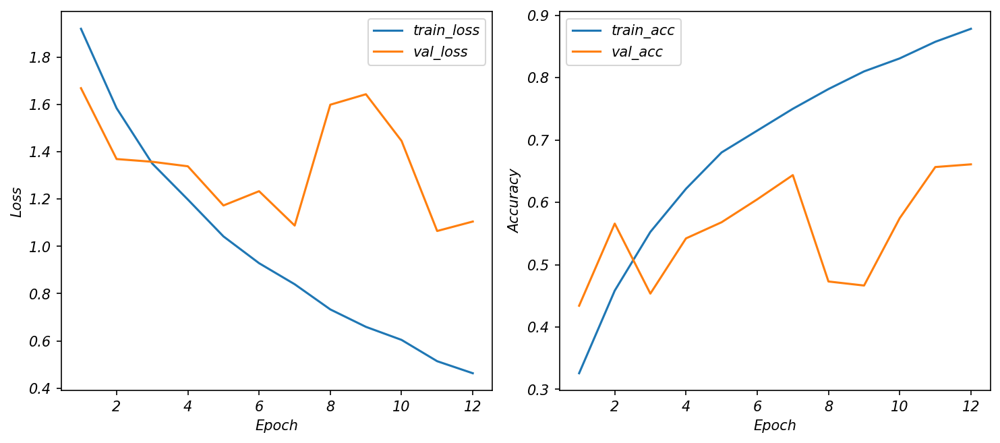
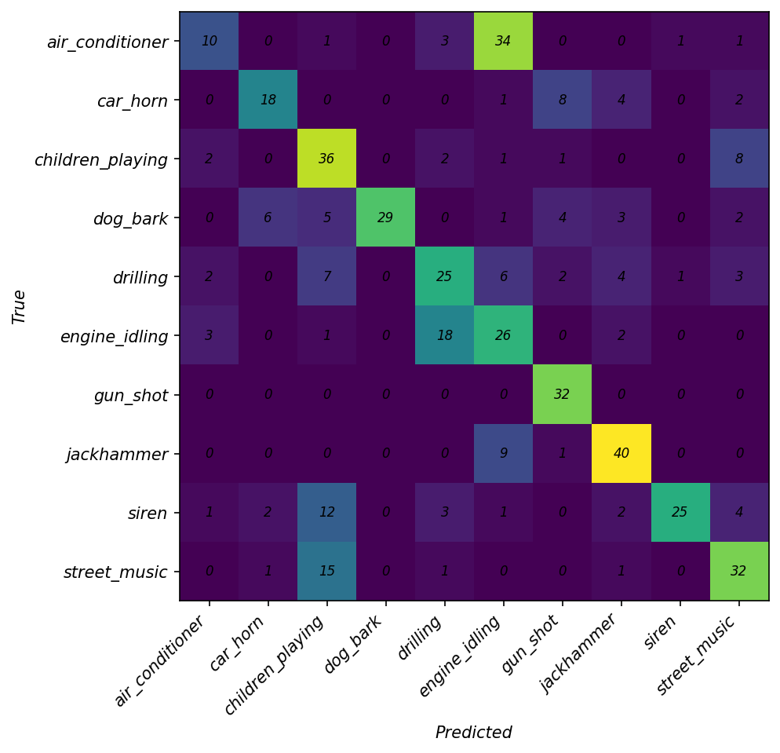
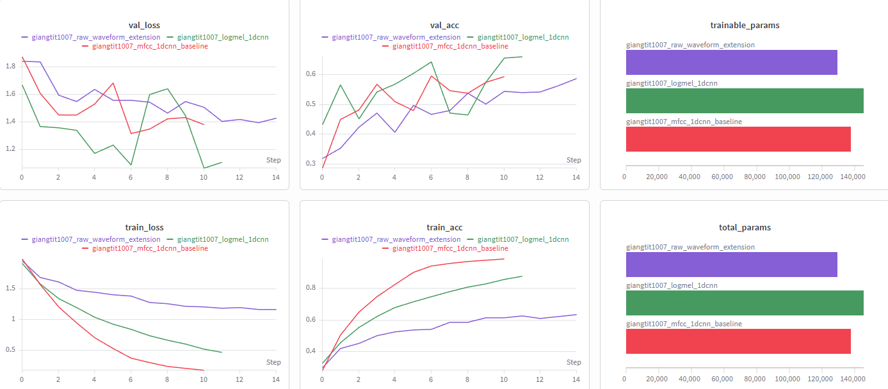
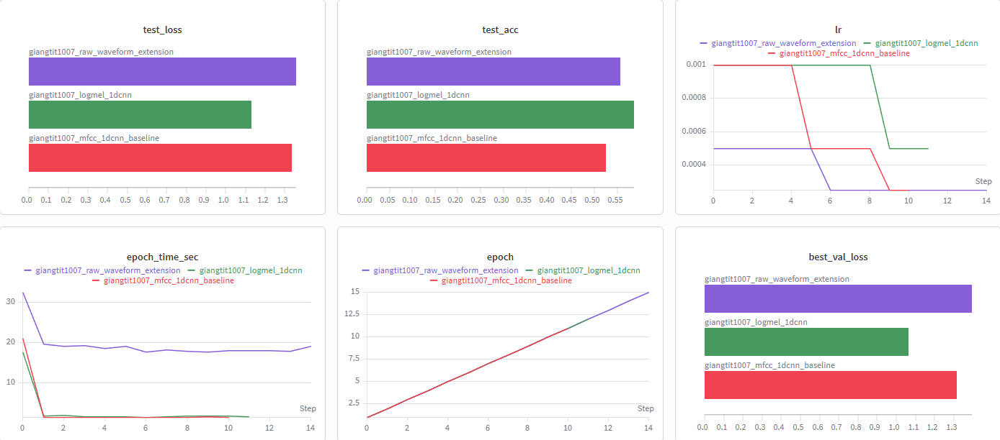
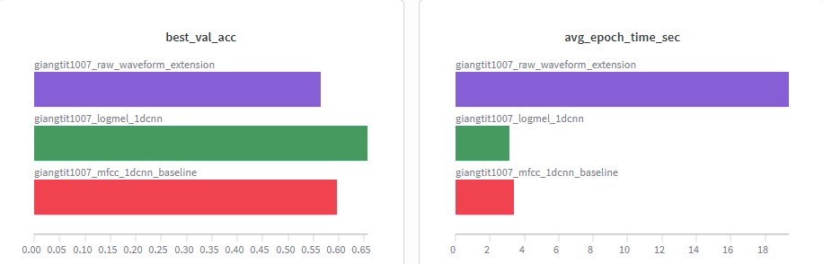

# CSC4005 Lab 3 Report – UrbanSound8K with 1D-CNN

## 1. Thông tin sinh viên

- Họ tên: Trần Trường Giang
- Mã sinh viên: 1671040009 
- Lớp: KHMT 16-01
- Link GitHub repo: https://github.com/FIT-DNU-CS-16-01/csc4005-lab3-1dcnn-trggiang0704-1
- Link W&B run/project: https://wandb.ai/giangtit1007-dainam-vietnam/csc4005-lab3-urbansound-1dcnn?nw=nwusergiangtit1007

---

## 2. Mục tiêu thí nghiệm

Mục tiêu của lab là xây dựng pipeline phân loại âm thanh môi trường trên bộ dữ liệu UrbanSound8K bằng mô hình 1D-CNN.

- Phân loại âm thanh môi trường trên UrbanSound8K.
- Sử dụng MFCC/log-mel làm chuỗi đặc trưng theo thời gian.
- Xây dựng và huấn luyện 1D-CNN.
- Theo dõi thí nghiệm bằng W&B.
- Phân tích lỗi bằng confusion matrix.

---

## 3. Dữ liệu và tiền xử lý

### 3.1. Dataset

- Dataset: UrbanSound8K
- Số lớp: 10
- Các lớp:
  - air_conditioner
  - car_horn
  - children_playing
  - dog_bark
  - drilling
  - engine_idling
  - gun_shot
  - jackhammer
  - siren
  - street_music
- Fold dùng để train: fold 1 đến fold 8
- Fold dùng để validation: fold 9
- Fold dùng để test: fold 10

### 3.2. Tiền xử lý audio

| Thành phần | Giá trị |
|---|---|
| Sample rate | 16000 Hz |
| Duration | 4.0 giây |
| Feature type | MFCC, log-mel, raw waveform |
| n_mfcc / n_mels | n_mfcc = 40, n_mels = 64 |
| n_fft | 1024 |
| hop_length | 512 |
| Augmentation | Có bật augmentation cho train set |

Cần đưa audio về cùng sample rate để tất cả file âm thanh có cùng số điểm tín hiệu trên mỗi giây. Nếu sample rate khác nhau, đặc trưng trích xuất ra sẽ không đồng nhất, khiến mô hình khó học.

Cần pad/crop audio về cùng độ dài vì mô hình cần input có kích thước cố định trong mỗi batch. Những file quá dài được crop, còn những file quá ngắn được pad để đưa về cùng độ dài chuẩn.

---

## 4. Mô hình 1D-CNN

Mô tả kiến trúc mô hình:

```text
Input feature sequence
→ Conv1D block 1
→ Conv1D block 2
→ Conv1D block 3
→ Global Average Pooling
→ Dense classifier
→ Softmax
```

Với MFCC/log-mel, input đưa vào mô hình có dạng:

```text
[batch_size, feature_channels, time_frames]
```

Trong đó `feature_channels` là số hệ số MFCC hoặc số mel bands, còn `time_frames` là số frame theo thời gian.

Bảng cấu hình:

| Thành phần | Giá trị |
|---|---|
| model_name | mfcc_1dcnn / logmel_1dcnn / raw_1dcnn |
| hidden_channels | [64, 128, 128] |
| dropout | 0.35 |
| optimizer | adamw |
| learning rate | 0.001 |
| weight decay | 0.0001 |
| batch size | 32 |
| epochs | 12 với MFCC/log-mel, 15 với raw waveform |
| patience | 4 |

---

## 5. Kết quả thực nghiệm

### 5.1. Kết quả chính

Best model được chọn là **log-mel + 1D-CNN** vì có kết quả validation và test tốt nhất trong các run đã chạy.

| Metric | Giá trị |
|---|---:|
| Best validation accuracy | 0.6566 |
| Best validation loss | 1.0647 |
| Test accuracy | 0.5871 |
| Test loss | 1.1300 |
| Average epoch time | 3.14 giây/epoch |
| Total parameters | 145,610 |
| Trainable parameters | 145,610 |

### 5.2. Learning curves

```markdown

```

Nhận xét:

- `train_loss` giảm từ khoảng 1.9197 xuống 0.4633 sau 12 epoch, cho thấy mô hình học được đặc trưng từ tập train.
- `val_loss` giảm từ khoảng 1.6686 xuống mức tốt nhất 1.0647, nhưng vẫn có dao động ở một số epoch.
- `train_acc` tăng từ 0.3258 lên 0.8783, còn `val_acc` đạt tốt nhất 0.6566.
- Mô hình vẫn có dấu hiệu overfitting nhẹ vì train accuracy cao hơn validation accuracy, nhưng mức overfitting thấp hơn MFCC baseline.
- Early stopping không xảy ra ở run log-mel, mô hình chạy đủ 12 epoch.

### 5.3. Confusion matrix

```markdown

```

Nhận xét:

- Những lớp dễ phân loại:
  - `gun_shot`: đúng 32/32 mẫu, recall = 1.00.
  - `jackhammer`: đúng 40/50 mẫu, recall = 0.80.
  - `children_playing`: đúng 36/50 mẫu, recall = 0.72.
  - `street_music`: đúng 32/50 mẫu, recall = 0.64.
  - `dog_bark`: precision = 1.00, nghĩa là khi mô hình dự đoán là `dog_bark` thì hầu như đúng.
- Những lớp dễ bị nhầm:
  - `air_conditioner` chỉ đúng 10/50 mẫu, bị nhầm nhiều sang `engine_idling`.
  - `engine_idling` bị nhầm nhiều sang `drilling`.
  - `street_music` bị nhầm sang `children_playing`.
  - `siren` bị nhầm sang `children_playing`.
  - `car_horn` bị nhầm sang `gun_shot` và `jackhammer`.
- Nguyên nhân có thể do nhiều lớp âm thanh đô thị có đặc trưng gần nhau, cùng chứa nhiễu nền, âm máy móc, tiếng người hoặc nhiều nguồn âm chồng lên nhau.

---

## 6. W&B tracking

Dán link W&B:

```text
https://wandb.ai/giangtit1007-dainam-vietnam/csc4005-lab3-urbansound-1dcnn
```

Chèn ảnh dashboard W&B:

```markdown





```

Dashboard W&B dùng để theo dõi và so sánh ba run:

- `giangtit1007_mfcc_1dcnn_baseline`
- `giangtit1007_logmel_1dcnn`
- `giangtit1007_raw_waveform_extension`

Các thông tin được theo dõi gồm:

- learning curves,
- final metrics,
- configuration,
- confusion matrix image,
- số tham số,
- thời gian huấn luyện mỗi epoch.

Kết quả trên W&B cho thấy log-mel + 1D-CNN là cấu hình tốt nhất trong ba run vì có `best_val_acc` cao nhất, `best_val_loss` thấp nhất, `test_acc` cao nhất và `test_loss` thấp nhất.

---

## 7. Phân tích và thảo luận

### 1. Vì sao dùng 1D-CNN thay vì MLP cho chuỗi đặc trưng audio?

Dùng 1D-CNN vì dữ liệu audio sau khi trích xuất MFCC/log-mel là chuỗi đặc trưng theo thời gian. 1D-CNN có thể học các pattern cục bộ như âm ngắn, âm kéo dài, nhịp lặp hoặc sự thay đổi năng lượng. Nếu dùng MLP, mô hình sẽ khó khai thác quan hệ cục bộ giữa các frame theo thời gian.

### 2. Kernel 1D trong bài này đang trượt theo chiều nào?

Kernel 1D trượt theo trục thời gian của chuỗi đặc trưng audio. Với input dạng `[batch_size, feature_channels, time_frames]`, Conv1D học các mẫu biến thiên theo chiều `time_frames`.

### 3. MFCC giúp mô hình học dễ hơn raw waveform ở điểm nào?

MFCC tóm tắt thông tin phổ âm thanh theo thời gian, giúp input gọn hơn và có ý nghĩa hơn waveform thô. Raw waveform là chuỗi tín hiệu rất dài, ví dụ audio 4 giây với sample rate 16000 Hz có khoảng 64000 điểm tín hiệu. Nếu dùng raw waveform, mô hình phải tự học từ đầu các đặc trưng như biên độ, tần số, nhịp lặp và nhiễu nền.

### 4. Mô hình hiện tại còn hạn chế gì?

Mô hình vẫn còn nhầm nhiều ở các lớp có đặc trưng âm thanh gần nhau. Ví dụ, `air_conditioner` bị nhầm sang `engine_idling`, `engine_idling` bị nhầm sang `drilling`, còn `street_music` bị nhầm sang `children_playing`. Ngoài ra, validation loss vẫn dao động ở một số epoch, cho thấy mô hình chưa thật sự ổn định hoàn toàn.

### 5. Có thể cải thiện kết quả bằng cách nào?

Có thể cải thiện kết quả bằng cách:

- Tăng số lượng dữ liệu train hoặc bỏ giới hạn số mẫu mỗi lớp.
- Tuning learning rate, dropout, weight decay và batch size.
- Tăng cường augmentation cho audio.
- Thử kiến trúc CNN sâu hơn hoặc kết hợp CNN với RNN/Transformer.
- Chạy nhiều seed để kiểm tra độ ổn định.
- Phân tích kỹ các lớp hay nhầm để điều chỉnh preprocessing hoặc augmentation phù hợp hơn.

---

## 8. Bài mở rộng nếu có

| Pipeline | Feature/Input | Test accuracy | Nhận xét |
|---|---|---:|---|
| Baseline | MFCC + 1D-CNN | 0.5247 | Baseline chạy ổn, nhưng có dấu hiệu overfitting mạnh. Train accuracy đạt 0.9875 trong khi test accuracy chỉ đạt 0.5247. |
| Extension 1 | log-mel + 1D-CNN | 0.5871 | Kết quả tốt nhất trong ba run. Có best validation accuracy cao nhất, test accuracy cao nhất, loss thấp nhất và thời gian train nhanh nhất. |
| Extension 2 | raw waveform + 1D-CNN | 0.5570 | Học trực tiếp từ tín hiệu thô, test accuracy cao hơn MFCC nhưng thấp hơn log-mel. Thời gian train chậm nhất, khoảng 19.38 giây/epoch. |

Bảng so sánh chi tiết:

| Cấu hình | Best Val Acc | Best Val Loss | Test Acc | Test Loss | Avg Epoch Time | Trainable Params |
|---|---:|---:|---:|---:|---:|---:|
| MFCC + 1D-CNN | 0.5961 | 1.3142 | 0.5247 | 1.3361 | 3.41s | 137,930 |
| log-mel + 1D-CNN | 0.6566 | 1.0647 | 0.5871 | 1.1300 | 3.14s | 145,610 |
| raw waveform + 1D-CNN | 0.5637 | 1.3942 | 0.5570 | 1.3574 | 19.38s | 129,450 |

---

## 9. Kết luận

- Bài lab đã xây dựng được pipeline phân loại âm thanh môi trường trên UrbanSound8K bằng 1D-CNN.
- Việc chuẩn hóa sample rate và pad/crop audio về cùng độ dài là cần thiết để tạo input đồng nhất cho mô hình.
- MFCC + 1D-CNN là baseline ổn định, nhưng có dấu hiệu overfitting rõ.
- Log-mel + 1D-CNN cho kết quả tốt nhất với `best_val_acc = 0.6566` và `test_acc = 0.5871`, nên được chọn làm best model.
- Raw waveform + 1D-CNN có thể học trực tiếp từ tín hiệu thô, nhưng train chậm hơn nhiều và kết quả tổng thể thấp hơn log-mel.
- Confusion matrix cho thấy mô hình nhận diện tốt các lớp như `gun_shot`, `jackhammer`, `children_playing`, nhưng vẫn gặp khó với các lớp âm nền hoặc dễ nhầm như `air_conditioner`, `engine_idling` và `street_music`.
- W&B giúp theo dõi, trực quan hóa và so sánh các run để chọn best model dựa trên số liệu thay vì cảm tính.